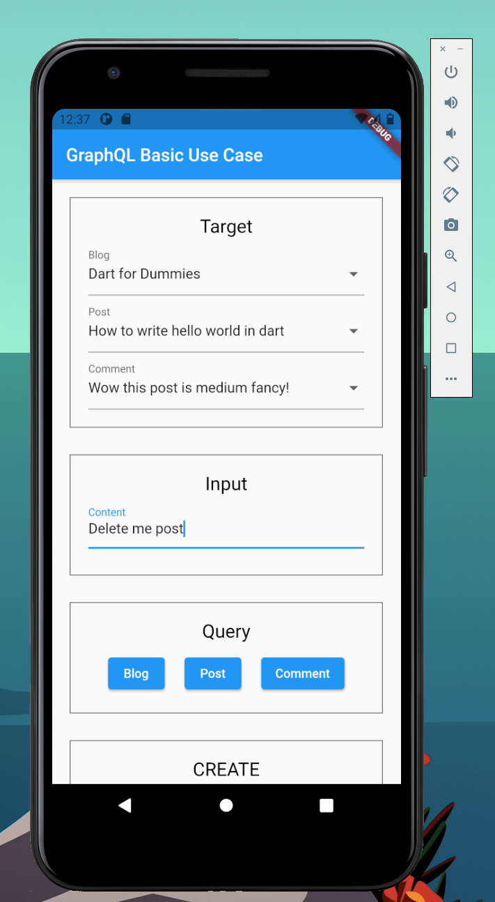
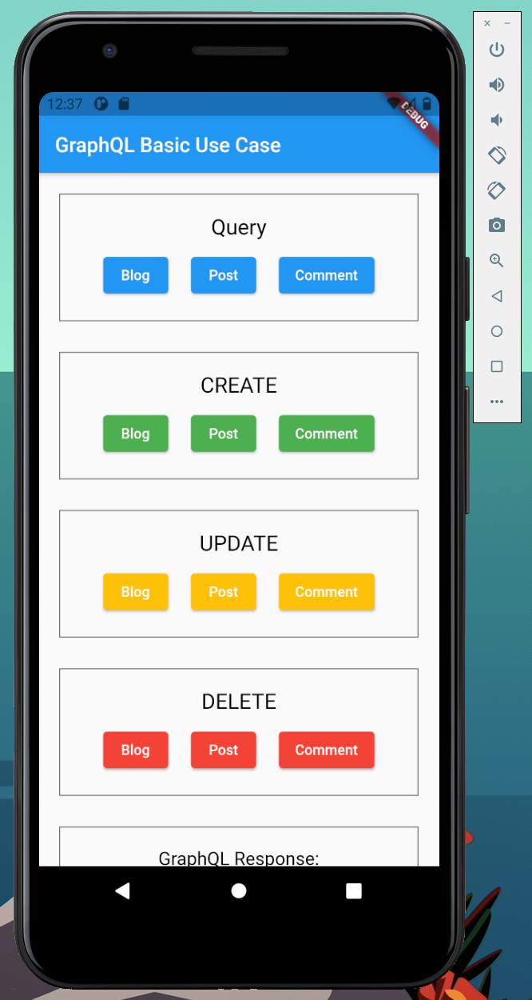
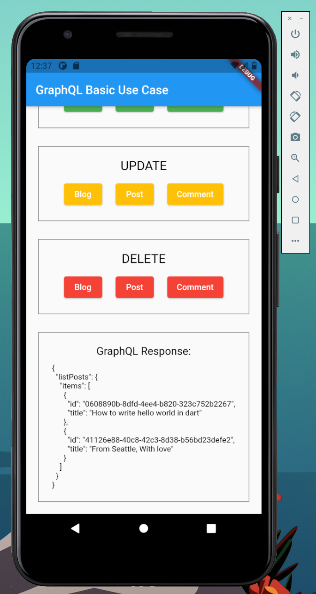

# Amplify-GraphQL-CRUD

An Amplify Flutter GraphQL CRUD APP.

## Getting Started

This app was bootstrapped using [Amplify CLI](https://docs.amplify.aws/cli)

For help getting started with Flutter, [online documentation](https://flutter.dev/docs), which offers tutorials, samples, guidance on mobile development, and a full API reference.

## Screenshots

